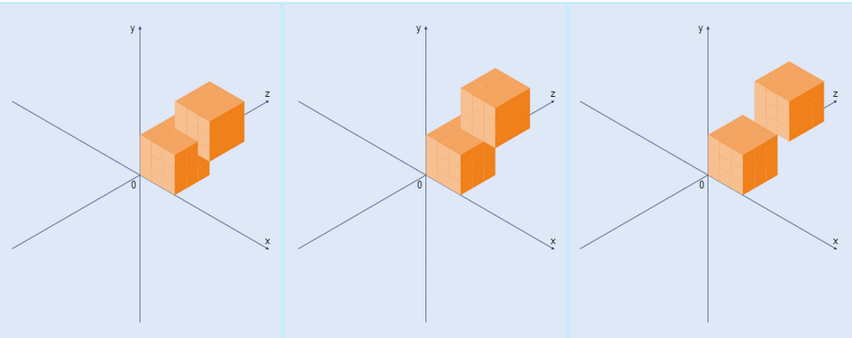

# qmese-copilot

## General information

You will be given **3 tasks** - ranging in difficulty from easiest to hardest. Each task will have a set of instructions and a set of tests. You should attempt to complete the tasks in order.

You will have **3 minutes** to get familiar with the tasks and **30 minutes** to attempt as many of the tasks as you can. 

> **Important!** - Each task will be timed, please use the provided timer app to track the completion time of each task by using the 'Lap' function and at the end use the export csv function to export the results to a csv file.

At the end of the time you will need to submit a zipped folder with your code as well as the timer csv file to the provided Google Drive.
## Rules

- Depending on which group you were assigned to, you will either be allowed to use code completion with Github Copilot or not be allowed to use any code completion tools at all.
- Do not use any 3rd party libraries, please do not to use any standard libraries if not completely necessary
- Try not to copy and paste full solutions from the web

## Links

**Timer App** - https://t.ly/W94pS

**Google Drive** - https://t.ly/4Mw_k

## Task 1 - List flattening
Your task is to write a function that takes a nested 
list of integers and flattens it. There can be many levels of nesting

**Input:** A list containing integers that may also contain nested lists of integers.


**Output:**  A flattened list containing only integers.

**Example:**
```python
flat_list([1, 2, 3, [4, 5]]) # [1, 2, 3, 4, 5]
```

## Task 2 - Horse racing
We have some horse racing statistics (each horse's time in each race).
You have to find the number of the horse which has the most wins.
For example: if the results are `[[“1:13”, “1:26”, “1:11”], [“1:10”, “1:18”, “1:14”], [“1:20”, “1:23”, “1:15”]]`, then the 3rd horse is the fastest, because it has won 2 races out of 3.
Every element in the list - is a string in format m:ss, for example, "1:05" or "2:22". 1:00 <= time <= 5:00 

**Input:** Racing times as an array of arrays.

**Output:**  The number of the fastest horse that has the most wins (Important: in this task the horse numbers starts from "1", not from "0").

**Example:**
```python
fastest_horse([[“1:13”, “1:26”, “1:11”], [“1:10”, “1:18”, “1:14”], [“1:20”, “1:23”, “1:15”]]) == 3
```

## Task 3 - Cubes
You are given a list of cube details (tuple of 4 integers: X coordinate, Y coordinate, Z coordinate, edge length).

> Each coordinate is the minimum value.
> All edges parallel to the coordinate axes.

If the cube share the part of another cube or touch with the face of another cube, they are considered as one object.
You should return a list (or iterable) of the volumes of all objects.



**Input:** A list of tuples of 4 integers: X coordinate, Y coordinate, Z coordinate, edge length.

**Output:**  A list of integers (volume of cubes).

**Example:**
```python
Example:
sorted(fused_cubes([(0, 0, 0, 3), (1, 2, 2, 3)])) == [52]       # fused
sorted(fused_cubes([(0, 0, 0, 3), (1, 3, 2, 3)])) == [54]       # touch with faces
sorted(fused_cubes([(0, 0, 0, 3), (1, 3, 3, 3)])) == [27, 27]   # touch with edges

```